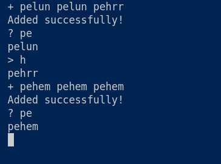

# MyTextHelper

## Общая информация

__ФИО__: Кожевников Александр Валерьевич

Задача __№2__

## Запуск решения

```bash
go run main.go
```

## Взаимодействие с программой

- __Добавление текста__ - знак '+'
```bash
+ pelun pelun pehrr
```

- __Запрос__ - знак '?'
```bash
? pe
```

- __Дописывание__ - знак '>'
```bash
> h
```

## Описание решения

Используется структура данных бор для хранения слов.

Преимущество данной структуры в том, что запросы выполняются быстро:
- Добавление слова происходит за его длину
- Запросы исполняются за длину ответа

Недостатком данной структуры может являться расходуемая память, но в данном случае в вершинах бора хранятся только существующие переходы, что улучшает данный показатель.

В каждой вершине бора поддерживается информация о количестве слов, для которых данная вершина является терминальной, и информация о дочернем поддереве с самым популярным словом. Запросы исполняются с помощью данной информации.

## Структура проекта

1. __Пакет helper__

Здесь реализована внутренняя логика бора.

2. __Пакет connector__

Здесь реализовано взаимодействие пользователя со структурой.

3. __Файл main.go__

Запускает программу на стандартном вводе и выводе.

## Пример работы проекта



## Запуск тестов

```bash
go test -v ./connector/...
```
